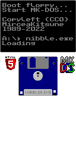

# Escape from Nibbles

https://mirceakitsune.github.io/nibbles

Retro style block puzzle game, move and rotate the pills to form a chain of colors. Press the ` key during the game for more info. Written in pure HTML5 / CSS / JavaScript and less than 1000 lines of engine code, a single settings object can be defined to create your own game with unique rules. Licensed CC0 / PublicDomain: Code graphics and chat sounds by MirceaKitsune, Public Pixel font by GGBotNet, sound by RubberDuck, music by Centurion of War.

